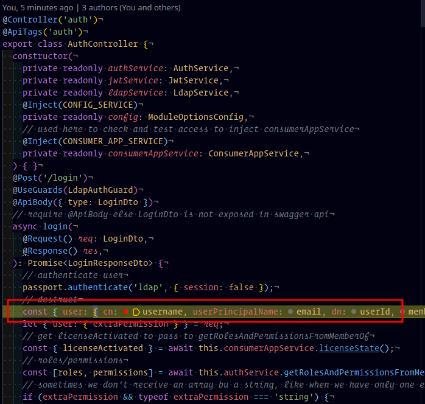
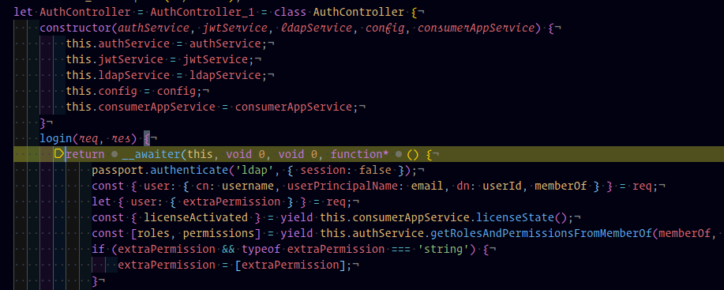
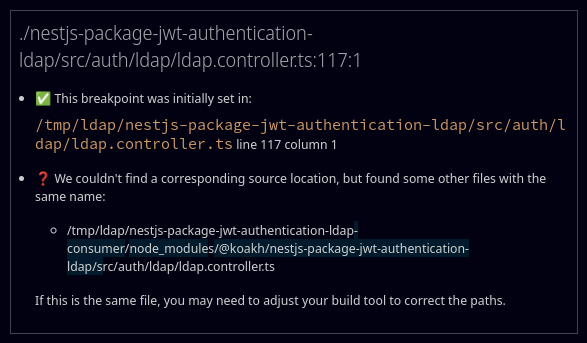

# NOTES

- [NOTES](#notes)
  - [Starter Project](#starter-project)
    - [Links](#links)
  - [TLDR](#tldr)
    - [Connect to LDAP form a remote machine](#connect-to-ldap-form-a-remote-machine)
      - [Option #1 : Expose eth0](#option-1--expose-eth0)
      - [Option #2 : Create tunnel to connect to c3 LDAP](#option-2--create-tunnel-to-connect-to-c3-ldap)
    - [Change .env to use tunnel](#change-env-to-use-tunnel)
    - [Install Nest Cli](#install-nest-cli)
    - [Debug package and consumer App](#debug-package-and-consumer-app)
    - [Test Api](#test-api)
  - [Read base Starter Notes](#read-base-starter-notes)
  - [LDAP](#ldap)
  - [Use LdapJs](#use-ldapjs)
  - [Example of Search Users with LdapJs](#example-of-search-users-with-ldapjs)
  - [Problems](#problems)
  - [Ignore debug error message](#ignore-debug-error-message)
  - [Extract data from JWT in Endpoints, ex Extract injected User](#extract-data-from-jwt-in-endpoints-ex-extract-injected-user)
  - [Add AuthRoles Guard, Decorator etc](#add-authroles-guard-decorator-etc)
  - [ldapjs Password Change](#ldapjs-password-change)
  - [Install anc Configure OpenApi on consumer App and package](#install-anc-configure-openapi-on-consumer-app-and-package)
    - [Installation](#installation)
    - [Bootstrap](#bootstrap)
    - [Add @ApiProperty() to schemas](#add-apiproperty-to-schemas)
  - [unexpected number of matches (2) for "c3" username](#unexpected-number-of-matches-2-for-c3-username)
  - [Unit Tests](#unit-tests)
    - [Config File](#config-file)
    - [Install prerequisites](#install-prerequisites)
    - [Run unit tests](#run-unit-tests)
  - [\[ExceptionsHandler\] unexpected number of matches (2) for "c3" username](#exceptionshandler-unexpected-number-of-matches-2-for-c3-username)
  - [Property 'user' does not exist on type 'Request\<ParamsDictionary, any, any, ParsedQs, Record\<string, any\>\>](#property-user-does-not-exist-on-type-requestparamsdictionary-any-any-parsedqs-recordstring-any)
  - [Update of latest problems of **unbounded breakpoint** in debug in LG Gram](#update-of-latest-problems-of-unbounded-breakpoint-in-debug-in-lg-gram)
  - [Gram http Client Request don't respond and Term2 window will be black without any response](#gram-http-client-request-dont-respond-and-term2-window-will-be-black-without-any-response)

## Starter Project

### Links

- [Publishing NestJS Packages with npm](https://dev.to/nestjs/publishing-nestjs-packages-with-npm-21fm)
- [nestjsplus/nestjs-package-starter](https://github.com/nestjsplus/nestjs-package-starter)
- [Koakh/NestJsPackageStarter](https://github.com/koakh/NestJsPackageStarter)
- [GitHub: NestJsPackageJwtAuthentication](https://github.com/koakh/NestJsPackageJwtAuthentication)
- [NPM: NestJsPackageJwtAuthentication](https://www.npmjs.com/package/@koakh/nestjs-package-jwt-authentication-ldap)

## TLDR

UPDATE 2023-02-07 16:08:40: latest problems in LG GRAM, go to bottom and check "Update of latest problems of **unbounded breakpoint** in debug in LG Gram" section

project used node version `node/v12.8.1`
confirm to work with `v16.15.0` and `v19.3.0`

> this notes are the continuation of NOTES.md from [NestJsPackageStarter](https://github.com/koakh/NestJsPackageStarter/blob/main/NOTES.md) and [GitHub: NestJsPackageJwtAuthentication](https://github.com/koakh/NestJsPackageJwtAuthentication)

### Connect to LDAP form a remote machine

error1: prevent `Error: connect ECONNREFUSED 192.168.122.194:389`

error2: `LDAPError [InvalidCredentialsError]: 80090308: LdapErr: DSID-0C0903A9, comment: AcceptSecurityContext error, data 52e, v1db1`

`.env` : must change `LDAP_BIND_CREDENTIALS='$pJDRW%7%B%w_C1k'`, get ldap pass with `cat /etc/ldap.password`

#### Option #1 : Expose eth0

```shell
[ExceptionsHandler] connect ECONNREFUSED 192.168.122.194:389 +97867ms
Error: connect ECONNREFUSED 192.168.122.194:389
```

or miss `eth0` interface in samba config, fix add eth0

```shell
$ sudo nano /etc/samba/smb.conf

interfaces = lo br0 docker0 eth0

[sudo] password for c3:
$ sudo service samba-ad-dc restart
```

always check if firewall ports are enable

```shell
$ sudo ufw status | grep 389
389/tcp                    ALLOW       Anywhere                  
389/udp                    ALLOW       Anywhere                  
389/tcp (v6)               ALLOW       Anywhere (v6)             
389/udp (v6)               ALLOW       Anywhere (v6)
```

#### Option #2 : Create tunnel to connect to c3 LDAP

> Optional, if we use remote development in c3 we can skip bellow step

```shell
# open a new window and connect to c3, in c3
$ ssh c3@c3edu.online
$ ssh -f -N mario@192.168.1.2 -R 2210:localhost:389
$ ssh -f -N clkjump@cloudvpn.critical-links.com -R 2210:localhost:389
# or use one line
$ ssh -t c3@c3edu.online "ssh -f -N mario@192.168.1.1 -R 2210:localhost:389"
```

### Change .env to use tunnel

> Optional, if we use remote development in c3 we can skip bellow step

```shell
# ldap
# LDAP_ADDRESS="127.0.0.1"
# ldap using tunnel
LDAP_ADDRESS="192.168.1.1:2210"
```

### Install Nest Cli

```shell
$ npm install -g @nestjs/cli
# in nixos use `nix-shell -p nest-cli` to install @nestjs/cli
# or better use hust nestnix-shell and it will use shell.nix local config file
```

### Debug package and consumer App

WARNING: update 2023-02-07 11:47:31 debugger with **Unbound breakpoint** on lg gram, but it works in c3edu.online out of the box and version `v16.15.0`

WARNING: update 2021-10-29 12:25:38 Debugger breakpoints fails when load code from a path with symbolic links



OK > `code /mnt/storage/Home/Documents/Development/Node/@NestJsPackages/TypescriptNestJsPackageJwtAuthenticationLdap`
OK GRAM > `code /mnt/storage/Home/Documents/Development/Node/@NestJsPackages/TypescriptNestJsPackageJwtAuthenticationLdap`
OK GRAM NIX > `code /mnt/gram/disk2/Home/Development/Node/@NestJsPackages/TypescriptNestJsPackageJwtAuthenticationLdap`



KO > `code ~/Development/@Koakh/node-modules/@koakh/@NestJsPackages/TypescriptNestJsPackageJwtAuthenticationLdap`

```shell
# term1: package watch: build and watch
$ cd nestjs-package-jwt-authentication-ldap
$ npm run start:dev

# term2: consumer app (api)
$ cd nestjs-package-jwt-authentication-ldap-consumer/

# NOTE: before try debug always check if `nestjs-package-jwt-authentication-ldap` is a symbolic link with
$ ls -la node_modules/@koakh
# OK
lrwxrwxrwx   1 mario mario    47 fev  7 16:03 nestjs-package-jwt-authentication-ldap -> ../../../nestjs-package-jwt-authentication-ldap
# KO
drwxr-xr-x   4 mario mario  200 fev  7 17:21 nestjs-package-jwt-authentication-ldap

# in case of KO 
$ rm node_modules/@koakh/nestjs-package-jwt-authentication-ldap/ -r
$ cd node_modules/@koakh && ln -s ../../../nestjs-package-jwt-authentication-ldap && cd ../..

# now change 
$ LDAP_BIND_CREDENTIALS=$(cat /etc/ldap.password)
# with value
$ echo ${LDAP_BIND_CREDENTIALS}
# ex
LDAP_BIND_CREDENTIALS='5J8UALlzJ@lR_C1k'
# else we get the error `lde_message: '80090308: LdapErr: DSID-0C0903A9, comment: AcceptSecurityContext error, data 52e, v1db1'`

# now we can debug
$ npm run start:debug

# or debugger with "Launch Program"

# now press f5 to debug consumer app (without launch npm run start:dev)
# after changes in package, restart debugger with ctrl+shift+f5
# wait for...in debug console
[NestApplication] Nest application successfully started +2ms
```

> ALWAYS but ALWAYS use right paths without any simbolic links, see above the right path, and test a breakpoint asap

> to debug use `launch.json` with [F5] ("Attach to Process")

> if service not start check `DEBUG CONSOLE` window for errors

> UPDATE: 2020-11-30 11:52:50: Fixed `launch.json` now it works with sourceMaps and watch, just launch F5 and Done!

> NOTE: in any change restart debugger with `ctrl+shift+F5` and warn always `npm run build` to reflect changes, like when we change server port, and other consumer stuff, because when we are in debug we aren't watch and build changes

> to watch and build for changes when debug use `npm run start:dev` in **consumer app**

### Test Api

```shell
$ curl --request POST \
  --url http://localhost:3000/auth/login \
  --header 'content-type: application/json' \
  --data '{"username": "mario","password": "root"}'
```

## Read base Starter Notes

- [Read Notes](https://github.com/koakh/NestJsPackageStarter/blob/main/NOTES.md)

## LDAP

```shell
# in local machine connect to tunnel
$ ldapsearch -H ldap://192.168.1.1:2210 -x -D "cn=administrator,cn=users,dc=c3edu,dc=online" -w "Root123..." -b ou=passport-ldapauth "(uid=mario)"
# in c3
$ ldapsearch -H ldap://localhost:389 -x -D "cn=administrator,cn=users,dc=c3edu,dc=online" -w "Root123..." -b ou=passport-ldapauth "(uid=mario)"
# test user auth in shell
$ /usr/lib/squid/basic_ldap_auth -h 127.0.0.1 -D cn=administrator,cn=users,dc=c3edu,dc=online -W /etc/ldap.password -s sub -b dc=c3edu,dc=online -f '(samaccountname=%s)'
# now type user and pass
mario root
OK

# right way to use searchFilter
$ curl -X POST http://localhost:3000/ldap -d '{"username": "mario", "password": "root"}' -H "Content-Type: application/json"
{"dn":"CN=mario,CN=Users,DC=c3edu,DC=online","controls":[]}
```

## Use LdapJs

- [LdapJs Docs](http://ldapjs.org/)

```shell
$ cd nestjs-package-jwt-authentication-ldap
$ npm i ldapjs
$ npm i -D @types/ldapjs
```

## Example of Search Users with LdapJs

- [simple example to search for username · Issue #428 · ldapjs/node-ldapjs · GitHub](https://github.com/ldapjs/node-ldapjs/issues/428)

> Note for `scope`, the trick to filter in c3 is using `scope: "sub`

```typescript
this.ldapClient.search(this.searchBase, { attributes: this.searchAttributes, scope: 'sub', filter: '(cn=mario)' }, (err, res) => {
  if (err) Logger.log(err);
  res.on('searchEntry', (entry) => {
    Logger.log('entry: ' + JSON.stringify(entry.object, undefined, 2), LdapService.name);
  });
  ...
```

## Problems

start debug

```shell
Debugger attached.
Waiting for the debugger to disconnect...
/media/mario/storage/Home/Documents/Development/Node/@NestJsPackages/TypescriptNestJsPackageJwtAuthenticationLdap/nestjs-package-jwt-authentication-ldap-consumer/src/main.ts:1
import { ValidationPipe } from '@nestjs/common';
```

seems that is a port conflit, resolve the issue, build and test, before launch debugger

```shell
$ npm run dev
[Nest] 3700   - 11/30/2020, 10:55:03 AM   [Main] server started at https://localhost:3010 +1ms
# require build to use new port 3001
$ npm run build
```

## Ignore debug error message

when launch debug with F5 we can see bellow error on start, please ignore it, eveything works has expected, move on

```shell
Could not read source map for file:///media/mario/storage/Home/Documents/Development/Node/@NestJsPackages/TypescriptNestJsPackageJwtAuthenticationLdap/nestjs-package-jwt-authentication-ldap-consumer/node_modules/typescript/lib/typescript.js: ENOENT: no such file or directory, open '/media/mario/storage/Home/Documents/Development/Node/@NestJsPackages/TypescriptNestJsPackageJwtAuthenticationLdap/nestjs-package-jwt-authentication-ldap-consumer/node_modules/typescript/lib/typescript.js.map'
```

## Extract data from JWT in Endpoints, ex Extract injected User

- [Get current user in nestjs on a route without an AuthGuard](https://stackoverflow.com/questions/63257879/get-current-user-in-nestjs-on-a-route-without-an-authguard)

just extract `user` from request

```typescript
@Post('/user')
@UseGuards(JwtAuthGuard)
async createUserRecord(
  @Request() req,
  @Response() res,
  @Body() createLdapUserDto: CreateUserRecordDto,
): Promise<void> {
  console.log(req.user); 
```

the magic happens in `nestjs-package-jwt-authentication-ldap/src/auth/strategy/ldap.strategy.ts` where we inject user in request in `req.user = user;`

```typescript
@Injectable()
export class LdapStrategy extends PassportStrategy(Strategy, 'ldap') {
  constructor(private readonly configService: ConfigService) {
    super({
      // allows us to pass back the entire request to the callback
      passReqToCallback: true,
      server: {
        // ldapOptions
        url: `ldap://${configService.get(envConstants.LDAP_ADDRESS)}`,
        bindDN: configService.get(envConstants.LDAP_BIND_DN),
        bindCredentials: configService.get(envConstants.LDAP_BIND_CREDENTIALS),
        searchBase: configService.get(envConstants.LDAP_SEARCH_BASE),
        searchFilter: configService.get(envConstants.LDAP_SEARCH_USER_FILTER),
        searchAttributes: configService.get(envConstants.LDAP_SEARCH_USER_ATTRIBUTES).toString().split(','),
        ldapSearchCacheFilter: configService.get(envConstants.LDAP_SEARCH_CACHE_FILTER),
      },
    }, async (req: Request, user: any, done) => {
      // add user to request
      req.user = user;
      return done(null, user);
    });
  }
}
```

## Add AuthRoles Guard, Decorator etc

- [Documentation | NestJS - A progressive Node.js framework](https://docs.nestjs.com/guards#role-based-authentication)

add files

- `nestjs-package-jwt-authentication-ldap/src/auth/decorators/roles.decorator.ts`
- `nestjs-package-jwt-authentication-ldap/src/auth/enums/roles.enum.ts`
- `nestjs-package-jwt-authentication-ldap/src/auth/strategy/role.strategy.ts`
- `nestjs-package-jwt-authentication-ldap/src/auth/guards/role-auth.guard.ts`
- `nestjs-package-jwt-authentication-ldap/src/auth/auth.module.ts`

```typescript
import { JwtStrategy, LdapStrategy,RoleStrategy } from './strategy';
...
@Module({
  ...
  providers: [
    AuthService, JwtStrategy, LdapStrategy, RoleStrategy, LdapService,
  ],
})
```

use guards like that

```typescript
constructor(private readonly ldapService: LdapService) { }
@Post('/user')
@Roles(UserRoles.C3_ADMINISTRATOR)
@UseGuards(RolesAuthGuard)
@UseGuards(JwtAuthGuard)
async createUserRecord(
  @Request() req,
  @Response() res,
  @Body() createLdapUserDto: CreateUserRecordDto,
): Promise<void> {
```

## ldapjs Password Change

- [ldapjs Password Change](https://gist.github.com/mattwoolnough/4ab72ad0d00b9f3067bb55835bda1566)

```typescript
Client.modify(userDN, [
  new ldap.Change({
    operation: 'delete',
    modification: {
      unicodePwd: encodePassword(oldPassword)
    }
  }),
  new ldap.Change({
    operation: 'add',
    modification: {
      unicodePwd: encodePassword(newPassword)
    }
  })
```

> When sending **add** and **delete** at the same time **Active Directory** treats it as a **normal password reset**, to perform an **administrator password reset** Active Directory only expects to receive the **replace** command.

## Install anc Configure OpenApi on consumer App and package

- [Documentation | NestJS - A progressive Node.js framework](https://docs.nestjs.com/openapi/introduction)
- [Sample Project](/media/mario/storage/Home/Documents/Development/Node/@NestJs/NodeNestJsSwaggerSample)

### Installation

```shell
$ cd nestjs-package-jwt-authentication-ldap-consumer/
$ npm i @nestjs/swagger swagger-ui-express
```

### Bootstrap

Once the installation process is complete, open the `main.ts` file and initialize Swagger using the SwaggerModule class:

```typescript
async function bootstrap() {
  const app = await NestFactory.create(AppModule);
  // global prefix
  app.setGlobalPrefix('v1');
  // openApi
  const options = new DocumentBuilder()
    .setTitle('Cats example')
    .setDescription('The cats API description')
    .setVersion('1.0')
    .addTag('cats')
    .build();
  const document = SwaggerModule.createDocument(app, options);
  SwaggerModule.setup('api', app, document);

  await app.listen(3000);
}
bootstrap();
```

> done run app and go to <http://localhost:3010/api/>

> To generate and download a Swagger JSON file, navigate to <http://localhost:3010/api-json> (swagger-ui-express)

### Add @ApiProperty() to schemas

```shell
# add @nestjs/swagger to package to use `@ApiProperty()`
$ cd nestjs-package-jwt-authentication-ldap
$ npm i @nestjs/swagger
```

get schemas, add `@ApiProperty()`

- CreateUserRecordDto
- AddDeleteUserToGroupDto
- SearchUserRecordsDto
- ChangeUserPasswordDto

> HINT: **Instead of manually annotating each property**, consider using the **Swagger plugin** (see [Plugin section](https://docs.nestjs.com/openapi/cli-plugin)) which will automatically provide this for you

> Please, note that your filenames must have one of the following suffixes: `['.dto.ts', '.entity.ts']` (e.g., create-user.dto.ts) in order to be analysed by the plugin

- [Using the CLI plugin](https://docs.nestjs.com/openapi/cli-plugin#using-the-cli-plugin)

To enable the plugin, open `nest-cli.json` (if you use Nest CLI) and add the following plugins configuration:


add `compilerOptions` to `nest-cli.json`

```json
{
  "language": "ts",
  "collection": "@nestjs/schematics",
  "sourceRoot": "src",
  "compilerOptions": {
    "plugins": ["@nestjs/swagger"]
  }  
}
```


npm i -D @nestjs/cli @nestjs/schematics


https://trilon.io/blog/eliminating-redundancy-with-nestjs-cli-plugins
To enable plugins, open up the nest-cli.json file (if you use Nest CLI) and add the following plugins configuration:
IF YOU USE CLI
we use 
    "start": "ts-node -r tsconfig-paths/register src/main.ts",
    "start:dev": "nodemon",
    "start:debug": "nodemon --config nodemon-debug.json",
and not
    "start": "nest start",
    "start:dev": "nest start --watch",
    "start:debug": "nest start --debug --watch",


fuck after we use `nest start` all local task endpoints start working and dtos to
only non consumer app don't work

- CreateUserRecordDto
- AddDeleteUserToGroupDto
- SearchUserRecordsDto
- ChangeUserPasswordDto


the trick to make appear Auth Dto's on swagger is usign the missing attribute `@Body` in `@Request` :(

```typescript
@Controller('auth')
@ApiTags('auth')
export class AuthController {
  ...
  @Post('/login')
  @UseGuards(LdapAuthGuard)
  @ApiBody({ type: LoginDto })
  // require @ApiBody else LoginDto is not exposed in swagger api
  async login(
    @Request() req: LoginDto,
    // TODO add LoginResponseDto 
    @Response() res,
  ): Promise<LoginResponseDto> {
    // authenticate user
    passport.authenticate('ldap', { session: false });
```


@ApiParam({name: 'operation', enum: ['replace', 'add', 'delete']})


- [Documentation | NestJS - A progressive Node.js framework](https://docs.nestjs.com/openapi/types-and-parameters#generics-and-interfaces)

BUT IF WE USE @Body we can't login :(
to solve use `@ApiBody({ type: [LoginDto] })`

- [NestJS, Modules and Swagger best practices](https://cimpleo.com/blog/nestjs-modules-and-swagger-best-practices/)

## unexpected number of matches (2) for "c3" username

`.env`

```shell
occurs in new iso and the problem is in 
change
LDAP_SEARCH_BASE="dc=c3edu,dc=online"
to
LDAP_SEARCH_BASE='ou=People,dc=c3edu,dc=online'
```

## Unit Tests

### Config File

```shell
# jwt
ACCESS_TOKEN_JWT_SECRET='secretKeyAccessToken'
ACCESS_TOKEN_EXPIRES_IN='15m'
REFRESH_TOKEN_JWT_SECRET='secretKeyRefreshToken'
REFRESH_TOKEN_EXPIRES_IN='7d'
REFRESH_TOKEN_SKIP_INCREMENT_VERSION='false'
# ldap
LDAP_ADDRESS='c3edu.online'
LDAP_BIND_DN='cn=administrator,cn=users,dc=c3edu,dc=online'
LDAP_BIND_CREDENTIALS='Root123...'
LDAP_SEARCH_BASE='ou=People,dc=c3edu,dc=online'
LDAP_SEARCH_USER_FILTER='(cn={{username}})'
LDAP_SEARCH_USER_ATTRIBUTES='cn,givenName,sn,displayName,userPrincipalName,memberOf,userAccountControl,objectCategory,distinguishedName,mail,lastLogonTimestamp,gender,c3UserRole,dateOfBirth,studentID,telephoneNumber,extraPermission'
LDAP_SEARCH_CACHE_FILTER='(objectCategory=CN=Person,CN=Schema,CN=Configuration,DC=c3edu,DC=online)'
AUTH_ADMIN_ROLE='C3_ADMINISTRATOR'
LDAP_BASE_DN='dc=c3edu,dc=online'
LDAP_NEW_USER_DN_POSTFIX='ou=People'
```

### Install prerequisites

```shell
# enter path
$ cd nestjs-package-jwt-authentication-ldap
# install prerequisites
$ npm i @golevelup/ts-jest
$ npm i -D jest-mock-req-res
```

### Run unit tests

Execution:

```shell
# Terminal 1:
$ cd nestjs-package-jwt-authentication-ldap
$ npm run start:dev

# Terminal 3:
$ cd nestjs-package-jwt-authentication-ldap
$ npx jest
# or 
$ or npm run test
# using coverage
$ npx jest --coverage
```

## [ExceptionsHandler] unexpected number of matches (2) for "c3" username

seems this error occurs when we use a wrong `LDAP_SEARCH_BASE` and we can see the root cause in c3-backend because we don't see nothing in logs, ony the response with error 500

response on consumer app

```json
{
  "statusCode": 500,
  "message": "Internal server error"
}
```

response on c3-backend

```json
{  
  "statusCode": 500,  
  "path": "/v1/auth/login",  
  "errorType": "Error" 
}
```

```env
# leaves this not here
# KO: gives [ExceptionsHandler] unexpected number of matches (2) for "c3" username. error: {  "statusCode": 500,  "path": "/v1/auth/login",  "errorType": "Error" }
# LDAP_SEARCH_BASE='dc=c3edu,dc=online'
# OK
LDAP_SEARCH_BASE='ou=People,dc=c3edu,dc=online'
```

## Property 'user' does not exist on type 'Request<ParamsDictionary, any, any, ParsedQs, Record<string, any>>

```shell
src/auth/strategy/ldap.strategy.ts:29:11 - error TS2339: Property 'user' does not exist on type 'Request<ParamsDictionary, any, any, ParsedQs, Record<string, any>>'.
```

fix with

```shell
$ npm i -D @types/express
```

## Update of latest problems of **unbounded breakpoint** in debug in LG Gram



this problem occur when we use `npm i ../nestjs-package-jwt-authentication-ldap` that somehow create a copy of `nestjs-package-jwt-authentication-ldap` and not symbolic link, and this create a hard do find problem, until we found what is the root cause

the solution comes after checkout and install the dependencies on c3 with node `v16.15.0`, in that specific case it works out of the box

after copied this working project `backup.tgz` from a c3 to local machine (gram), it works

this is what let me figure out the problem

the problem is that the package `nestjs-package-jwt-authentication-ldap` installed with `npm i` > `"@koakh/nestjs-package-jwt-authentication-ldap": "file:../nestjs-package-jwt-authentication-ldap"` is not a symbolic link of the sources that we use in project

is a copied version of it, that somehow waste a few hours to debug

the trick is always using the symbolic link path

```shell
# OK
$ ls -la /mnt/storage/Home/Documents/Development/Node/@NestJsPackages/TypescriptNestJsPackageJwtAuthenticationLdap/nestjs-package-jwt-authentication-ldap-consumer/node_modules/@koakh
# this is a a symlink of nestjs-package-jwt-authentication-ldap
lrwxrwxrwx   1 mario mario    47 fev  7 11:45 nestjs-package-jwt-authentication-ldap -> ../../../nestjs-package-jwt-authentication-ldap

# KO
$ ls -la /mnt/storage/Home/Documents/Development/Node/@NestJsPackages/TypescriptNestJsPackageJwtAuthenticationLdap/nestjs-package-jwt-authentication-ldap-consumer/node_modules/@koakh_
# this is a folder not a symlink of nestjs-package-jwt-authentication-ldap
drwxr-xr-x   4 mario mario  4096 fev  6 17:26 nestjs-package-jwt-authentication-ldap
```

to prove that we can revert to KO folder and delete `nestjs-package-jwt-authentication-ldap` and create a symbolic link with

```shell
$ mv /mnt/storage/Home/Documents/Development/Node/@NestJsPackages/TypescriptNestJsPackageJwtAuthenticationLdap/nestjs-package-jwt-authentication-ldap-consumer/node_modules/@koakh/nestjs-package-jwt-authentication-ldap/ /tmp/
$ ln -s ../../../nestjs-package-jwt-authentication-ldap
```

WARN: the other option is install the package (`npm i ../nestjs-package-jwt-authentication-ldap`) and let npm create the symbolic link, this will create a lot of problems with new versions of node and will re-install everything, **AND WILL NOT WORK with current node `v19.3.0`, with that node version it will create the folder and not the symbolic link and this is what creates the problem

## Gram http Client Request don't respond and Term2 window will be black without any response

fix use a curl and it will respond, and term2 window will not be blank

```shell
$ curl --request POST \
  --url http://localhost:3010/v1/auth/login \
  --header 'content-type: application/json' \
  --data '{"username": "dev","password": "qhA1Bpn5s5","forceActivatedLicense": true}' | jq
```
